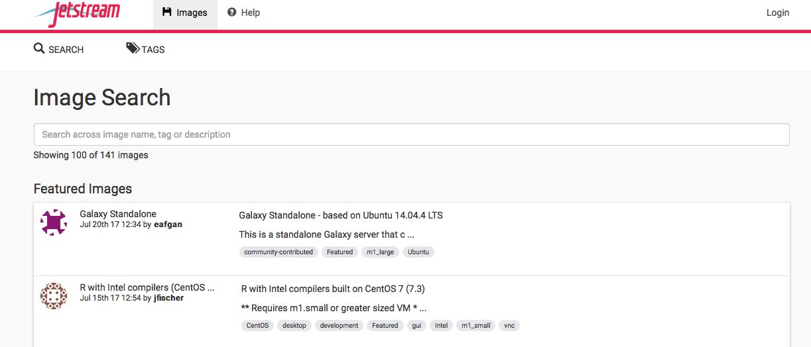

Launch a Jetstream instance
---

#### Login
Navigate to https://use.jetstream-cloud.org/

 

### Login using your XSEDE credentials

 

### Type your stuff in, and select "SIGN IN"

 

### Click on "Projects"

 

### Create a New Project

 

### Fill in details about project
You have to Name it and write a description. Make it something sensible.

 

### Search for the right machine type. "Ubuntu 16.04"

 

### Name the instance, select the appropriate size, and LAUNCH

 

### Wait for your instance to become active. This will take between 2 and 10 minutes.

 

